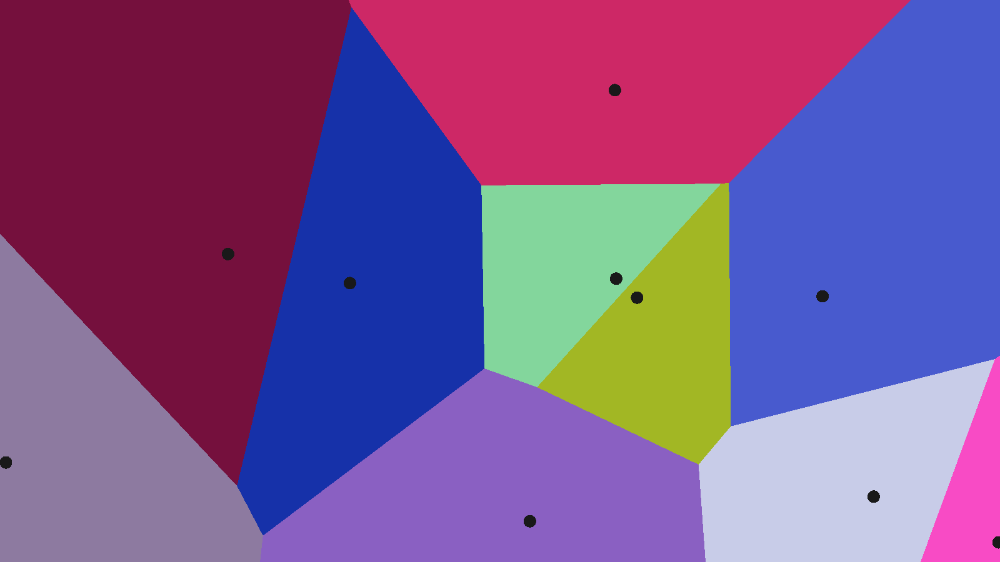
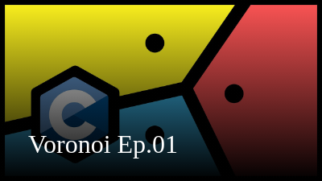
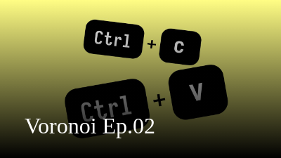

# Voronoi with OpenGL using Depth Buffer



## Quick Start

```console
$ ./build.sh
$ ./voronoi-opengl
```

## Screencasts

[](https://www.youtube.com/watch?v=kT-Mz87-HcQ)
[](https://www.youtube.com/watch?v=qIOAz7M1syw)
